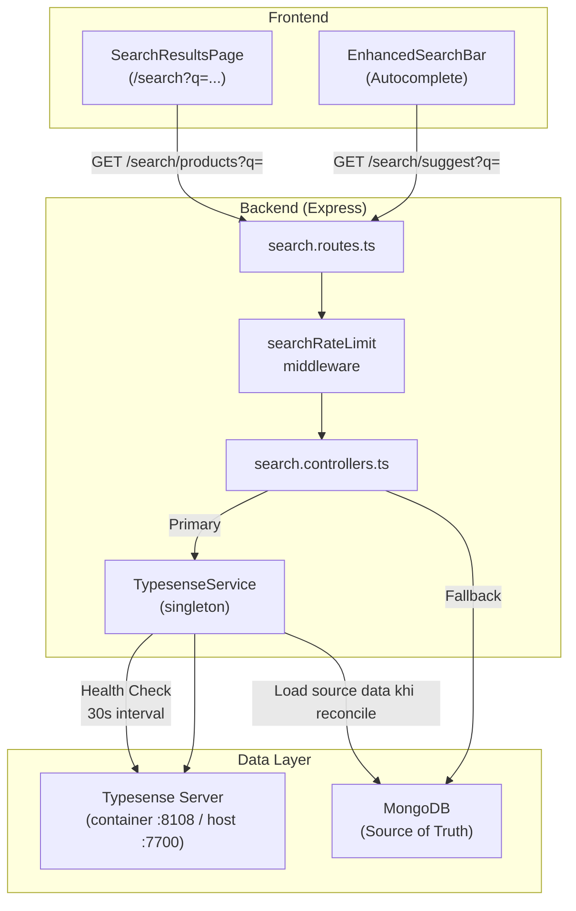
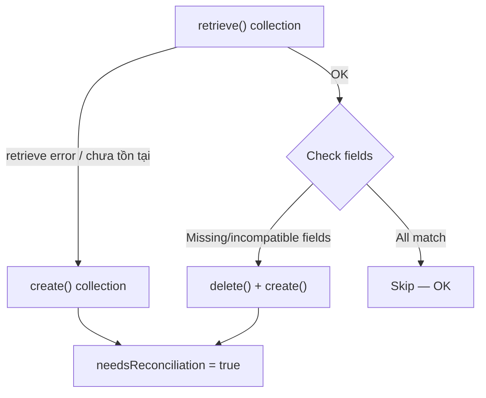
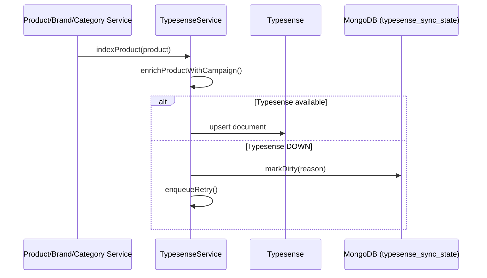
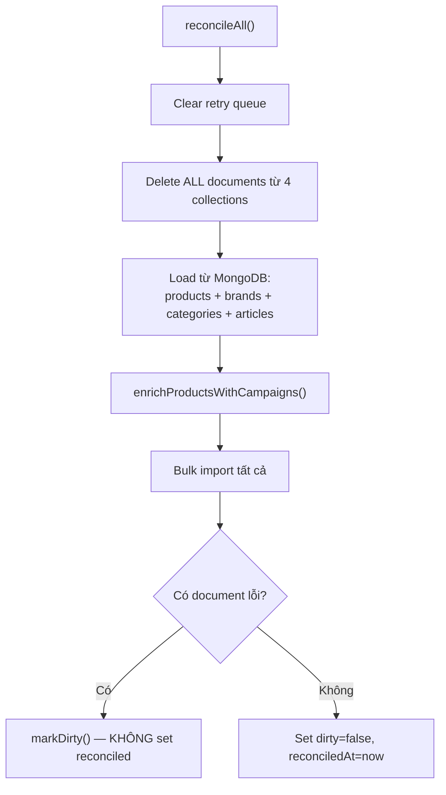
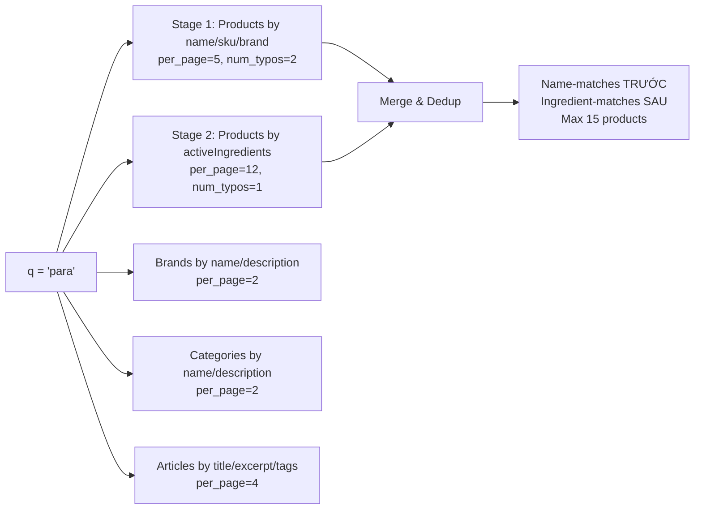
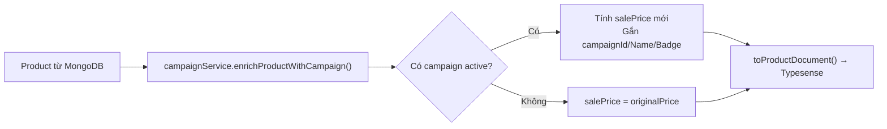

# Đặc tả hệ thống tìm kiếm Typesense

> **Phiên bản:** 1.0  
> **Cập nhật:** 2026-06-06  
> **Phạm vi:** Backend MEDISPACE E-Commerce và các luồng Frontend sử dụng Search API  
> **Trạng thái:** Đã triển khai lexical search, autocomplete, MongoDB fallback và reconciliation trên nhánh `feature/typesense-search-consistency-fixes`

Tài liệu mô tả implementation hiện tại. Typesense là read model phục vụ tìm kiếm; MongoDB vẫn là source of truth.

---

## Mục lục

1. [Tổng quan kiến trúc](#1-tổng-quan-kiến-trúc)
2. [Cấu hình & Kết nối](#2-cấu-hình--kết-nối)
3. [Collections & Schema](#3-collections--schema)
4. [Đồng bộ MongoDB → Typesense](#4-đồng-bộ-mongodb--typesense)
5. [API Endpoints](#5-api-endpoints)
6. [Gợi ý tìm kiếm (Suggest / Autocomplete)](#6-gợi-ý-tìm-kiếm-suggest--autocomplete)
7. [Tìm kiếm sản phẩm (Search Products)](#7-tìm-kiếm-sản-phẩm-search-products)
8. [Tìm kiếm bài viết (Search Articles)](#8-tìm-kiếm-bài-viết-search-articles)
9. [Tìm kiếm tiếng Việt](#9-tìm-kiếm-tiếng-việt)
10. [Campaign & Giá khuyến mại](#10-campaign--giá-khuyến-mại)
11. [MongoDB Fallback](#11-mongodb-fallback)
12. [Rate Limiting](#12-rate-limiting)
13. [Health Monitoring & Consistency](#13-health-monitoring--consistency)
14. [FE Integration](#14-fe-integration)
15. [Performance](#15-performance)
16. [Giới hạn hiện tại](#16-giới-hạn-hiện-tại)
17. [Runbook vận hành và kiểm thử](#17-runbook-vận-hành-và-kiểm-thử)

---

## 1. Tổng quan kiến trúc



### Luồng hoạt động chính

1. **User gõ từ khóa** → FE gọi `GET /search/suggest?q=...` (debounce 300ms)
2. **User nhấn Enter** → Navigate đến `/search?q=...` → FE gọi `GET /search/products?q=...`
3. **Backend** nhận request → Rate limit check → Query Typesense
4. **Typesense down?** → Product/article search fallback sang MongoDB regex search; suggest trả danh sách rỗng
5. **Typesense hồi phục?** → Health check detect → Full reconciliation → Quay lại Typesense

---

## 2. Cấu hình & Kết nối

### Environment Variables

| Variable | Mặc định | Mô tả |
|----------|----------|-------|
| `TYPESENSE_HOST` | `localhost` | Host Typesense server |
| `TYPESENSE_PORT` | `7700` | Port client kết nối; dùng `8108` khi BE chạy trong Docker network |
| `TYPESENSE_API_KEY` | `medispace-ts-secret` | API key xác thực |

### Docker Compose

```yaml
typesense:
  image: typesense/typesense:27.1
  ports:
    - "7700:8108"
  volumes:
    - ../typesense-data-dev:/data
  environment:
    TYPESENSE_API_KEY: ${TYPESENSE_API_KEY:-medispace-ts-secret}
    TYPESENSE_DATA_DIR: /data
```

Khi BE chạy bằng Compose, `TYPESENSE_HOST=typesense` và `TYPESENSE_PORT=8108`. Khi chạy BE trực tiếp trên máy host, client dùng mặc định `localhost:7700`.

### Typesense Client

```typescript
const client = new Typesense.Client({
  nodes: [{ host: 'localhost', port: 7700, protocol: 'http' }],
  apiKey: 'medispace-ts-secret',
  connectionTimeoutSeconds: 5
})
```

---

## 3. Collections & Schema

Hệ thống quản lý **4 collections** trong Typesense:

### 3.1 Products Collection

| Field | Type | Flags | Mô tả |
|-------|------|-------|-------|
| `mongoId` | string | — | MongoDB `_id` |
| `name` | string | **infix** | Tên sản phẩm (hỗ trợ tìm giữa từ) |
| `slug` | string | index: false | URL slug |
| `sku` | string | **infix** | Mã SKU |
| `barcode` | string | optional | Mã vạch |
| `shortDescription` | string | optional | Mô tả ngắn |
| `categoryId` | string | **facet** | ID danh mục |
| `categoryName` | string | **facet** | Tên danh mục |
| `brandId` | string | facet, optional | ID thương hiệu |
| `brandName` | string | facet, optional | Tên thương hiệu |
| `requiresPrescription` | bool | **facet** | Thuốc kê đơn? |
| `isActive` | bool | **facet** | Đang bán? |
| `inStock` | bool | **facet** | Còn hàng? |
| `stockQuantity` | int32 | — | Số lượng tồn |
| `price` | float | — | Giá bán (= salePrice) |
| `originalPrice` | float | — | Giá gốc |
| `salePrice` | float | — | Giá sau giảm |
| `discountPercentage` | int32 | — | % giảm giá |
| `defaultUnit` | string | optional | Đơn vị mặc định |
| `priceVariantsJson` | string | optional, index: false | JSON biến thể giá |
| `maxOrderQuantity` | int32 | — | Số lượng tối đa/đơn |
| `campaignId` | string | optional | ID campaign đang áp dụng |
| `campaignName` | string | optional | Tên campaign |
| `campaignBadgeText` | string | optional | Badge text (VD: "-30%") |
| `campaignBadgeColor` | string | optional, index: false | Màu badge |
| `campaignEndDate` | int64 | optional | Timestamp kết thúc campaign |
| `searchTextNormalized` | string | optional | Text đã bỏ dấu tiếng Việt |
| `rating` | float | — | Điểm đánh giá (0-5) |
| `reviewCount` | int32 | — | Số lượt đánh giá |
| `featuredImage` | string | index: false, optional | URL ảnh đại diện |
| `activeIngredients` | string | optional | Hoạt chất |
| `indications` | string | optional | Chỉ định |
| `manufacturer` | string | optional, **facet** | Nhà sản xuất |
| `dosageForm` | string | optional | Dạng bào chế |
| `strength` | string | optional | Hàm lượng |
| `packSize` | string | optional | Quy cách đóng gói |
| `dosageInstructions` | string | optional | Hướng dẫn liều dùng |
| `storageInstructions` | string | optional | Hướng dẫn bảo quản |
| `createdAt` | int64 | — | Timestamp tạo |

- **Default sorting**: `rating`
- **Token separators**: `-`, `/`, `(`, `)`, `.`, `,`

### 3.2 Articles Collection

| Field | Type | Flags | Mô tả |
|-------|------|-------|-------|
| `mongoId` | string | — | MongoDB `_id` |
| `title` | string | — | Tiêu đề bài viết |
| `slug` | string | index: false | URL slug |
| `excerpt` | string | optional | Tóm tắt |
| `content` | string | optional | Nội dung (stripped HTML, max 5000 chars) |
| `categoryId` | string | facet, optional | ID danh mục sức khỏe |
| `categoryName` | string | facet, optional | Tên danh mục |
| `tags` | string[] | facet, optional | Tags |
| `riskLevel` | string | facet, optional | Mức độ rủi ro |
| `targetAudiences` | string[] | facet, optional | Đối tượng |
| `symptoms` | string[] | facet, optional | Triệu chứng |
| `activeIngredients` | string[] | facet, optional | Hoạt chất liên quan |
| `healthTopics` | string[] | facet, optional | Chủ đề sức khỏe |
| `authorName` | string | optional | Tác giả |
| `isPublished` | bool | **facet** | Đã xuất bản? |
| `isFeatured` | bool | **facet** | Nổi bật? |
| `viewCount` | int32 | — | Lượt xem |
| `publishedAt` | int64 | optional | Ngày xuất bản |
| `featuredImage` | string | index: false, optional | Ảnh đại diện |

- **Default sorting**: `viewCount`

### 3.3 Brands Collection

| Field | Type | Flags |
|-------|------|-------|
| `mongoId` | string | — |
| `name` | string | — |
| `slug` | string | — |
| `description` | string | optional |
| `country` | string | optional, facet |
| `logo` | string | optional, index: false |
| `isActive` | bool | facet |
| `productCount` | int32 | — |

### 3.4 Categories Collection

| Field | Type | Flags |
|-------|------|-------|
| `mongoId` | string | — |
| `name` | string | — |
| `slug` | string | — |
| `description` | string | optional |
| `isActive` | bool | facet |
| `level` | int32 | facet |
| `productCount` | int32 | — |
| `icon` | string | optional, index: false |

### Schema Auto-Detection

Khi backend khởi động, `ensureCollections()` kiểm tra từng collection:



Kiểm tra bao gồm: **missing fields**, **sai type**, **sai facet/optional/infix/index flags**.

Kiểm tra hiện chưa phát hiện field dư, thay đổi `default_sorting_field` hoặc thay đổi `token_separators`.

---

## 4. Đồng bộ MongoDB → Typesense

### 4.1 Luồng đồng bộ real-time



### 4.2 Các sự kiện trigger đồng bộ

| Sự kiện | Hàm được gọi | Mô tả |
|---------|-------------|-------|
| Tạo sản phẩm | `indexProduct()` | Upsert vào Typesense |
| Sửa sản phẩm | `indexProduct()` | Upsert (overwrite) |
| Xóa sản phẩm | `removeProduct(mongoId)` | Xóa theo `mongoId` filter |
| Bật/tắt sản phẩm | `indexProduct()` | Cập nhật `isActive` |
| Thay đổi tồn kho | `indexProduct()` | Cập nhật `stockQuantity`, `inStock` |
| Review mới | `indexProduct()` | Cập nhật `rating`, `reviewCount` |
| Tạo/sửa/xóa brand | `indexBrand()` / `removeBrand()` | Đồng bộ brands |
| Tạo/sửa/xóa category | `indexCategory()` / `removeCategory()` | Đồng bộ categories |
| Tạo/sửa/xóa article | `indexArticle()` / `removeArticle()` | Đồng bộ articles |
| Campaign CRUD | `requestReconciliation()` | Full reindex |
| Brand/Category productCount đổi | `indexBrand()` / `indexCategory()` | Cập nhật count |

### 4.3 runOrQueue Pattern

Mọi write operation đều đi qua `runOrQueue()`:

```
runOrQueue(description, operation)
  ├─ Typesense available? → run() trực tiếp
  │   ├─ Thành công → ✅ Done
  │   └─ Thất bại → markDirty() + enqueueRetry(attempts+1)
  └─ Typesense DOWN → markDirty() + enqueueRetry()
```

- **Max retry**: 5 lần/operation
- **Max queue size**: 500 operations
- **Queue flush**: Mỗi 30s (health check cycle)

### 4.4 Dirty Marker

Khi sync thất bại, hệ thống ghi **dirty marker** vào MongoDB:

```typescript
// Collection: typesense_sync_state
{
  key: 'global',
  dirty: true,
  reason: 'indexProduct 6a23cd78...',
  updatedAt: ISODate("2026-06-06T07:30:00Z")
}
```

`reason` là mô tả operation gần nhất hoặc lỗi reconciliation, không phải durable log của toàn bộ operations đã thất bại.

### 4.5 Full Reconciliation

Triggered khi:
1. Backend startup (`initCollections()`)
2. Typesense hồi phục sau khi down (health check detect)
3. Campaign fingerprint thay đổi
4. Internal trigger qua `requestReconciliation()`, hiện được campaign service sử dụng



### 4.6 Campaign Fingerprint

Hệ thống theo dõi campaigns đang active bằng fingerprint:

```typescript
// Format: "{id}:{updatedAt}:{startDate}:{endDate}|..."
const fingerprint = campaigns.map(c => 
  `${c._id}:${c.updatedAt?.getTime?.()}:${c.startDate}:${c.endDate}`
).join('|')
```

Fingerprint chỉ gồm campaign có `status=active` và đang nằm trong khoảng `startDate..endDate`. Health cycle kiểm tra fingerprint mỗi 30 giây; khi thay đổi hệ thống full reconciliation để reindex giá mới.

---

## 5. API Endpoints

| Method | Path | Rate Limit | Mô tả |
|--------|------|-----------|-------|
| `GET` | `/search/suggest?q=` | 30 req/min | Autocomplete gợi ý |
| `GET` | `/search/products?q=&...` | 60 req/min | Full-text search sản phẩm |
| `GET` | `/search/articles?q=&...` | 60 req/min | Full-text search bài viết |
| `GET` | `/search/status` | Không limit | Health check |

File: `src/routes/search.routes.ts`

---

## 6. Gợi ý tìm kiếm (Suggest / Autocomplete)

### 6.1 API: `GET /search/suggest?q=`

**Request**:
```
GET /search/suggest?q=para
```

**Response**:
```json
{
  "products": [
    {
      "document": {
        "mongoId": "...",
        "name": "Paracetamol 500mg",
        "slug": "paracetamol-500mg",
        "featuredImage": "https://...",
        "price": 15000,
        "rating": 4.5,
        "brandName": "PharmaCo",
        "requiresPrescription": false
      }
    }
  ],
  "brands": [...],
  "categories": [...],
  "articles": [...]
}
```

### 6.2 Chiến lược Multi-Stage Search

Suggest thực hiện **5 queries song song** qua `multiSearch`:



### 6.3 Xếp hạng ưu tiên

| Priority | Source | Weights |
|----------|--------|---------|
| 1st | Products by name | `name:4, sku:3, brandName:3, dosageForm:1, strength:1` |
| 2nd | Products by ingredients | `activeIngredients:4, indications:2, shortDescription:1` |
| 3rd | Brands | `name, description` |
| 4th | Categories | `name, description` |
| 5th | Articles | `title:5, excerpt:3, tags:2, healthTopics:3, symptoms:3` |

### 6.4 OTC ưu tiên

Khi không filter riêng `requiresPrescription`, thuốc OTC (không kê đơn) được ưu tiên trước thuốc kê đơn:
```
sort_by: '_text_match:desc, requiresPrescription:asc, stockQuantity:desc'
```
→ `requiresPrescription:asc` = `false(0)` trước `true(1)`

### 6.5 Kết quả trả về

| Collection | Max items | Fields trả về |
|-----------|-----------|---------------|
| Products (name match) | 5 | mongoId, name, slug, featuredImage, price, rating, brandName, requiresPrescription |
| Products (ingredient match) | 12 | (giống trên) |
| Products (merged, deduped) | **15** | — |
| Brands | 2 | mongoId, name, slug, logo, productCount |
| Categories | 2 | mongoId, name, slug, icon, productCount, level |
| Articles | 4 | mongoId, title, slug, excerpt, featuredImage, categoryName, tags, riskLevel |

---

## 7. Tìm kiếm sản phẩm (Search Products)

### 7.1 API: `GET /search/products`

| Param | Type | Default | Mô tả |
|-------|------|---------|-------|
| `q` | string | `*` | Từ khóa (empty = browse all) |
| `page` | number | 1 | Trang kết quả, clamp tối thiểu 1 |
| `limit` | number | 20 | Kết quả/trang, clamp trong khoảng 1–100 |
| `categoryId` | string | — | Filter theo danh mục (bao gồm descendants) |
| `brandId` | string | — | Filter theo thương hiệu |
| `requiresPrescription` | bool | — | `true`/`false` |
| `inStock` | bool | — | Chỉ còn hàng |
| `priceMin` / `minPrice` | number | — | Giá tối thiểu |
| `priceMax` / `maxPrice` | number | — | Giá tối đa |
| `ratingMin` | number | — | Đánh giá tối thiểu |
| `sortBy` | string | `relevance` | `price_asc`, `price_desc`, `rating`, `newest` |

### 7.2 Category Descendants

Khi filter `categoryId`, hệ thống **tự tìm tất cả sub-categories**:

```typescript
// Input: categoryId = "thuốc" (parent)
// Tìm category path: /thuoc
// Regex: ^/thuoc(?:/|$)
// → Tìm tất cả: thuốc, thuốc/hạ-sốt, thuốc/kháng-sinh, ...
const categoryIds = await db.categories.find({
  $or: [
    { _id: categoryId },
    { path: { $regex: `^${escapedPath}(?:/|$)` } }
  ]
}).map(c => c._id.toString())

// Gửi Typesense: categoryId:=[id1,id2,id3,...]
```

### 7.3 Query Fields

```
query_by: name, shortDescription, sku, activeIngredients, indications,
          categoryName, brandName, dosageForm, strength, barcode, searchTextNormalized
```

Search sản phẩm hiện chưa cấu hình `query_by_weights`; relevance dùng `_text_match` mặc định của Typesense. `query_by_weights` chỉ đang được dùng trong suggest và article search.

### 7.4 Sort Logic

| `sortBy` | `sort_by` string |
|----------|-----------------|
| `relevance` (default) | `_text_match:desc, requiresPrescription:asc, rating:desc` |
| `price_asc` | `requiresPrescription:asc, price:asc` |
| `price_desc` | `requiresPrescription:asc, price:desc` |
| `newest` | `requiresPrescription:asc, createdAt:desc` |
| `rating` | `requiresPrescription:asc, rating:desc, reviewCount:desc` |

> **Note**: Khi `q=*` (browse mode), `_text_match` bị bỏ. Typesense giới hạn tối đa 3 sort fields.

### 7.5 Facet Counts

Response bao gồm `facet_counts` cho:
- `categoryId`, `categoryName`
- `brandId`, `brandName`
- `requiresPrescription`, `inStock`
- `manufacturer`

### 7.6 Response Format

```json
{
  "source": "typesense",
  "hits": [
    {
      "document": {
        "mongoId": "...",
        "name": "Paracetamol 500mg",
        "price": 15000,
        "salePrice": 12000,
        "campaignBadgeText": "-20%",
        ...
      },
      "highlight": {
        "name": { "snippet": "<mark>Paracetamol</mark> 500mg" }
      }
    }
  ],
  "found": 1078,
  "page": 1,
  "facet_counts": [...]
}
```

---

## 8. Tìm kiếm bài viết (Search Articles)

### API: `GET /search/articles`

| Param | Type | Default |
|-------|------|---------|
| `q` | string | `*` |
| `page` | number | 1 |
| `limit` | number | 10 |
| `categoryId` | string | — |

**Query fields & weights**:
```
title:5, excerpt:3, content:1, tags:2, healthTopics:3,
symptoms:3, activeIngredients:3, targetAudiences:2, categoryName:2
```

**Facets**: `categoryId`, `categoryName`, `tags`, `riskLevel`, `targetAudiences`, `healthTopics`

**Highlights**: `title`, `excerpt` (5 tokens context)

---

## 9. Tìm kiếm tiếng Việt

### 9.1 Normalization

Hệ thống xử lý tiếng Việt qua **dual-indexing**:

```typescript
function normalizeVietnamese(value: string): string {
  return value
    .normalize('NFD')                // Tách ký tự và dấu
    .replace(/[\u0300-\u036f]/g, '') // Bỏ dấu
    .replace(/[đĐ]/g, 'd')          // đ → d, Đ → d
    .toLowerCase()                    // → "thuoc"
}
```

### 9.2 Indexed Fields

Mỗi product được index theo hai nhóm field:
1. **Có dấu**: `name`, `shortDescription`, `activeIngredients`, `indications`
2. **Không dấu**: `searchTextNormalized` = `normalizeVietnamese(name + sku + brand + category + ...)`

### 9.3 Search Query

Khi user search "thuốc":
```
q = "thuốc thuoc"  // Gửi cả 2 phiên bản
query_by = "name,...,searchTextNormalized"
```

→ Match cả `name:"Thuốc hạ sốt"` VÀ `searchTextNormalized:"thuoc ha sot"`

Normalization này mới áp dụng cho product full search. Suggest và article search vẫn chủ yếu dựa vào tokenization/typo tolerance của Typesense.

### 9.4 Typo Tolerance

- Search: `num_typos: 2` (cho phép 2 ký tự sai)
- Suggest Stage 1: `num_typos: 2`
- Suggest Stage 2: `num_typos: 1`

---

## 10. Campaign & Giá khuyến mại

### 10.1 Enrichment Flow



### 10.2 Campaign Fields trong Typesense

| Field | Ví dụ | Mô tả |
|-------|-------|-------|
| `price` | 12000 | = salePrice (giá sau giảm) |
| `originalPrice` | 15000 | Giá gốc |
| `salePrice` | 12000 | Giá sau campaign |
| `discountPercentage` | 20 | % giảm |
| `campaignId` | `"6a23..."` | ID campaign |
| `campaignName` | `"Flash Sale T6"` | Tên campaign |
| `campaignBadgeText` | `"-20%"` | Badge hiển thị |
| `campaignBadgeColor` | `"#FF4444"` | Màu badge |
| `campaignEndDate` | `1717689600000` | Timestamp kết thúc |

### 10.3 Sort/Filter theo giá sale

`price` field = `salePrice` → Sort/filter theo giá đã giảm:
```
filter_by: price:[10000..50000]  // Filter theo giá sau giảm
sort_by: price:asc               // Sort theo giá sau giảm
```

---

## 11. MongoDB Fallback

Khi Typesense unavailable, search controller **tự động fallback** sang MongoDB:

### 11.1 Detection

```typescript
const tsResult = await typesenseService.searchProducts(params)
if (!tsResult) {
  // tsResult = null khi isAvailable = false hoặc search throw
  // → Chuyển sang MongoDB
}
```

### 11.2 MongoDB Fallback Logic

| Feature | Typesense | MongoDB Fallback |
|---------|-----------|-----------------|
| Text search | Full-text, typo tolerance | Regex `$or` (name, sku, shortDescription) |
| Product details | Hoạt chất, chỉ định, manufacturer | Lookup `productDetails` collection rồi match `activeIngredients`, `indications`, `manufacturer` |
| Category filter | `categoryId:=[ids]` | `categoryId: { $in: [ObjectIds] }` |
| Brand filter | `brandId:=id` | `brandId: new ObjectId(id)` |
| Price range | `price:[min..max]` theo sale price | `priceVariants.price: { $gte, $lte }` theo giá gốc |
| Sort | `_text_match, rating` | `rating: -1` |
| Pagination | `page`, `per_page` | `$skip`, `$limit` |
| Facets | 7 facet fields | ❌ Không có |
| Highlight | ✅ Snippet | ❌ Không có |
| Source | `"typesense"` | `"mongodb_fallback"` |

Fallback trả cùng shape cơ bản (`hits`, `found`, `page`) để FE tiếp tục hiển thị, nhưng không tương đương hoàn toàn với Typesense: không có facet/highlight/typo tolerance và chưa enrich campaign price.

Article search cũng fallback sang MongoDB regex trên title, excerpt, content và các mảng metadata. Suggest không có MongoDB fallback; khi Typesense unavailable nó trả bốn nhóm kết quả rỗng.

### 11.3 Security

Query text được escape trước khi dùng regex:
```typescript
const escapeRegex = (value: string) => 
  value.replace(/[.*+?^${}()|[\]\\]/g, '\\$&')
```

---

## 12. Rate Limiting

### In-memory Rate Limiter

File: `src/middlewares/search.middlewares.ts`

| Endpoint | Max Requests | Window |
|----------|-------------|--------|
| `/search/suggest` | 30 | 60 giây |
| `/search/products` | 60 | 60 giây |
| `/search/articles` | 60 | 60 giây |
| `/search/status` | Không limit | — |

### Cách hoạt động

- **Key**: `{IP}:{path}` — mỗi IP + path riêng biệt
- **Auto cleanup**: Khi map > 10,000 entries → xóa expired entries
- **429 Response**: `{ message: "Bạn đang tìm kiếm quá nhanh..." }` + `Retry-After` header
- Limiter nằm trong memory của từng BE instance; nhiều replica không chia sẻ counter.

---

## 13. Health Monitoring & Consistency

### 13.1 Health Check Cycle

```
Mỗi 30 giây:
  1. client.health.retrieve()
  2. Nếu từ DOWN → UP:
     ├─ ensureCollections()
     └─ reconcileIfNeeded(force=true)
  3. Nếu đang UP:
     ├─ reconcileIfNeeded() (check dirty + campaign fingerprint)
     └─ flushRetries()
```

### 13.2 API: `GET /search/status`

```json
{
  "typesense": true,
  "consistency": {
    "healthy": true,
    "dirty": false,
    "consistent": true,
    "mismatchedCollections": [],
    "counts": {
      "products": 3238,
      "articles": 17,
      "brands": 400,
      "categories": 252
    },
    "lastReconciledAt": "2026-06-06T07:26:50.243Z"
  },
  "mongoCounts": {
    "products": 3238,
    "articles": 17,
    "brands": 400,
    "categories": 252
  },
  "message": "Typesense is healthy"
}
```

### 13.3 Consistency Check

`consistent = true` khi:
- `healthy = true` (Typesense responds)
- `dirty = false` (không có pending sync)
- `mismatchedCollections = []` (Typesense counts = MongoDB counts)

`message` hiện chỉ phản ánh Typesense có kết nối được hay không; cần đọc thêm `consistency.consistent` để biết dữ liệu có đang lệch hay không.

---

## 14. FE Integration

### 14.1 Components

| Component | File | Mô tả |
|-----------|------|-------|
| `EnhancedSearchBar` | `src/components/shared/EnhancedSearchBar.tsx` | Thanh search + dropdown suggest |
| `SearchResultsPage` | `src/components/search/SearchResultsPage.tsx` | Trang kết quả tìm kiếm |

### 14.2 Search Service (FE)

File: `src/services/searchService.ts`

```typescript
searchService.suggest(q)           // → /search/suggest?q=
searchService.searchProducts(params) // → /search/products?q=&...
searchService.searchArticles(params) // → /search/articles?q=&...
searchService.getStatus()           // → /search/status
```

### 14.3 useSearchSuggestions Hook

File: `src/hooks/useSearchSuggestions.ts`

```typescript
const { products, brands, categories, articles, isLoading } = useSearchSuggestions(query)
```

- **Debounce**: 300ms
- **Min length**: 2 ký tự
- **Cache**: 30s (React Query staleTime)
- **Max results**: 7 products, 2 brands, 2 categories, 3 articles

### 14.4 Suggest Dropdown UI

```
┌──────────────────────────────────────┐
│ 🔍 Tìm thuốc, thực phẩm...         │
├──────────────────────────────────────┤
│ 🏷️ THƯƠNG HIỆU                     │
│  [logo] PharmaCo    [TH]  45 SP     │
├──────────────────────────────────────┤
│ 📁 DANH MỤC                         │
│  📁 Thuốc hạ sốt   [DM]  1000 SP   │
├──────────────────────────────────────┤
│ 📰 BÀI VIẾT SỨC KHỎE               │
│  [img] Paracetamol là gì?  [Blog]   │
├──────────────────────────────────────┤
│ 🔍 SẢN PHẨM                         │
│  [img] Paracetamol 500mg   [OTC]    │
│  [img] Para Plus Extra     [Kê đơn] │
└──────────────────────────────────────┘
```

### 14.5 Click Actions

| Click target | Action |
|-------------|--------|
| Product suggestion | Navigate → `/products/{slug}` |
| Brand suggestion | Navigate → `/search?brandSlug={slug}` |
| Category suggestion | Navigate → `/categories/{slug}` |
| Article suggestion | Navigate → `/health/article/{slug}` |
| Nhấn Enter | Navigate → `/search?q={query}` |

### 14.6 Keyboard Navigation

| Key | Action |
|-----|--------|
| `↓` | Di chuyển xuống suggestion |
| `↑` | Di chuyển lên suggestion |
| `Enter` | Chọn suggestion hiện tại hoặc search |
| `Escape` | Đóng dropdown |
| `⌘K` / `Ctrl+K` | Focus search bar |

---

## 15. Performance

Chưa có benchmark tự động hoặc số liệu P95/P99 được lưu trong repository. Không nên xem latency trên máy phát triển là cam kết production.

### Optimizations

1. **Infix search** chỉ cho `name` và `sku` (tránh overhead cho text dài)
2. **index: false** cho `slug`, `priceVariantsJson`, `featuredImage`, `campaignBadgeColor` (tiết kiệm bộ nhớ)
3. **include_fields** trong suggest → chỉ trả về fields cần thiết
4. **Token separators** cho dược phẩm: `-`, `/`, `(`, `)`, `.`, `,`
5. **Debounce 300ms** trên FE tránh spam API
6. **React Query cache 30s** cho suggest results
7. **Bulk import** cho reconciliation thay vì upsert từng document

---

## 16. Giới hạn hiện tại

- **Chưa có semantic/vector search**: schema không có embedding field và query không dùng `vector_query`. Search hiện tại là lexical/full-text search.
- **Reconciliation chưa zero-downtime**: worker xóa document cũ trước khi bulk import, nên search có thể tạm thời trả ít hoặc không có kết quả trong lúc rebuild.
- **Retry queue vẫn ở memory**: dirty marker trong Mongo đảm bảo lần reconcile sau sẽ sửa lệch dữ liệu, nhưng không lưu từng operation retry.
- **Mỗi startup đều full reconciliation**: bảo đảm sửa lệch sau restart nhưng làm tăng startup load và tạo khoảng search rỗng.
- **Không có distributed lock**: nhiều BE replica có thể cùng chạy reconciliation.
- **Fallback chưa campaign-aware**: filter/sort giá MongoDB fallback dùng giá variant gốc, có thể khác giá sale trên Typesense và FE.
- **Validation query còn hạn chế**: `page` và `limit` đã được clamp, nhưng price/rating chưa reject chặt giá trị âm hoặc `NaN`.
- **Filter value chưa được escape đầy đủ trước khi ghép `filter_by`**: đặc biệt `brandId` và category ID không hợp lệ cần được validate chặt hơn để giảm rủi ro malformed query/filter injection.
- **Vietnamese search chưa có business synonyms**: chưa map tên hoạt chất Việt/Anh, tên viết tắt hoặc từ đồng nghĩa y khoa.
- **Health consistency dựa chủ yếu vào count**: count bằng nhau không chứng minh nội dung từng document hoàn toàn giống MongoDB.
- **Health endpoint public và tương đối nặng**: `/search/status` không rate limit và chạy bốn `countDocuments()` mỗi request.
- **Schema migration dùng delete/recreate**: chưa sử dụng versioned collections và alias swap.
- **Seed có thể làm việc lặp**: `seed-typesense.ts` gọi `initCollections()`, trong khi startup init hiện force reconciliation trước khi script tiếp tục bulk seed.
- **FE search result không có media gallery**: index đủ dữ liệu cho ProductCard nhưng không thay thế product detail/listing payload đầy đủ.

## 17. Runbook vận hành và kiểm thử

### Seed hoặc rebuild thủ công

```bash
npm run seed:search
npm run seed:search -- --force
```

`--force` xóa cả bốn collections trước khi init và seed lại. Chỉ chạy khi MongoDB và Typesense đều sẵn sàng. Implementation hiện tại có thể full reconcile trong `initCollections()` rồi bulk seed thêm lần nữa; cần theo dõi load khi chạy trên dữ liệu lớn.

### Kiểm tra sau deploy

1. Gọi `GET /search/status`; xác nhận `typesense=true`, `dirty=false`, `consistent=true`.
2. Search một sản phẩm theo tên, SKU, hoạt chất và tên không dấu.
3. Filter category cha và xác nhận có sản phẩm thuộc category con.
4. Kiểm tra sort/filter price với một sản phẩm đang có campaign.
5. Tắt Typesense, cập nhật sản phẩm, bật lại Typesense và xác nhận reconciliation hoàn tất.

### Files chính

**Backend repository**

- `src/services/typesense.services.ts`
- `src/controllers/search.controllers.ts`
- `src/routes/search.routes.ts`
- `src/middlewares/search.middlewares.ts`
- `src/scripts/seed-typesense.ts`

**Frontend repository**

- `src/services/searchService.ts`
- `src/hooks/useSearchSuggestions.ts`
- `src/components/shared/EnhancedSearchBar.tsx`
- `src/components/search/SearchResultsPage.tsx`
